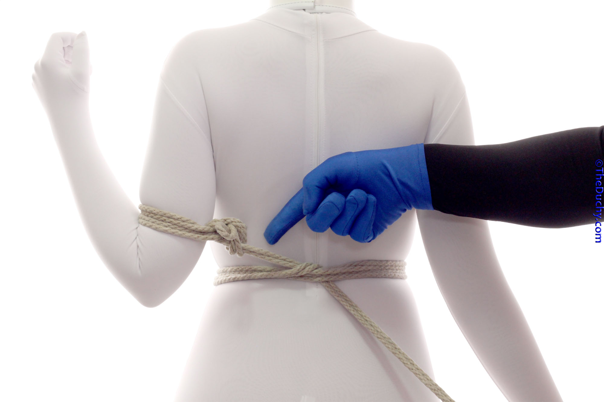
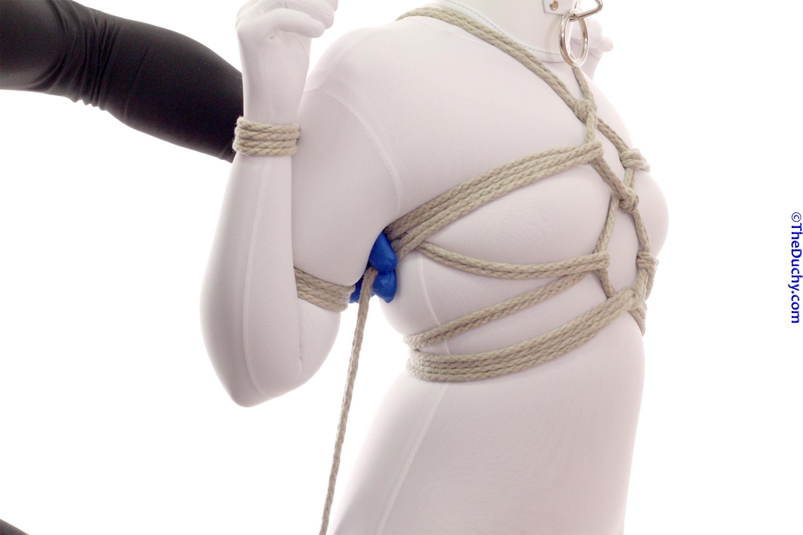

## [Tengu Chest Harness](https://www.theduchy.com/tengu)

-  This tie has it’s roots in Hojōjutsu, and was used to transport prisoners by boat.  </td>
-  Important Note #1: While this position can be comfortable for quite awhile for many people, __some may experience numbness in their hands due to the impact this position can have on their nerve paths__.  If this occurs, move the biceps cuffs a little further up the biceps away from the elbow. If the numbness doesn’t go away in 10-15 seconds, untie them immediately. A person with this issue is not a good candidate for this tie.
- Important Note #2: This version utilizes the “hojo cuff” technique. However there is a warning with this cuff: If both strands leading away from this cuff are under the same tension, the cuff is stable; however, __if the tension is uneven, this cuff is self-tightening__.  In its original context/use (to prevent the escape of actual prisoners) it was purposefully design to do this, but most riggers in a R.A.C.K. context generally work very hard to avoid collapsing knots due to the potential for injury.
- If the Tengu is tied correctly, both strands should be under even tension and the hojo cuff will not collapse. If you are not confident you can achieve consistent tension however, there is a simple (albeit, a bit fiddly) fix: Instead of using the hojo cuffs, use the In-line Burlington Bowline (ILBB).  This is a simple variation on what I show here, and is non-collapsing, so some prefer it. The down side is that it takes a little longer to tie and untie, and for ILBBs #2-4 it will require some working of the knot after it is tied to get the right tension.

-  1. Position one arm like a wing
-  2. Measure out about 3’ (1m) of rope which will be used to tie a hojo cuff around the lower biceps. See the Important Note above. If you are concerned about the collapsing nature of the “hojo cuff”, use the In-line Burlington Bowline (ILBB)
-  3. Being wrapping the bight end of the rope around one arm, below the biceps an above the elbow
-  4. Run the bight end around, wrapping upwards
-  5. You should have two wraps and enough of the bight left to reach several inches past the spine.
-  6. Bring the tail to the back of the arm (my right hand). (My left hand it just holding the bight end so it doesn’t fall…)
-  7. Bring the tail up over the strands of the cuff
-  8. Reach under the cuff from the opposite side
-  9. Grab the tail
-  10. Pull through
-  11. Add tension to the cuff by pulling both ends away from the arm toward the middle of the back. Do not pull the two ends apart, this will tighten the cuff.
-  12. Temporarily lock the cuff by using the bight end to make a slipped half hitch around the tail
-  13. Run the tail across your partner’s back…
-  14. … and around their torso, wrapping down.
-  15. This is your opportunity to set how “strict” this tie is going to be by choosing how tightly to pull their arm behind their back. Always work within your partner’s limits. For some people, this position can put too much pressure on the nerves in their shoulder (radial nerve and/or brachial plexus) and they may begin to feel tingling or numbness. Make sure they know to do finger checks and instruct them to alert you immediately if they feel anything odd sensation. If they do, untie them right away and let them recover. You may still be able to do this tie, but try with a less strict version…
-  16. Wrap around the torso twice, wrapping down
-  17. When you get to the spine a second time, tie off with a hard node by reaching under the torso wraps from below…
-  18. …laying the tail over the lines, hooking the tail with your fingers…
-  19. …and pulling down and through
-  20. Then reach under the line coming from the tied arm (from above)
-  21. Hook the tail
-  22. Pull through
-  23. Position the other arm like a wing
-  24. Tie another hojo cuff or In-line Burlington Bowline (ILBB) around the lower biceps. If you choose the ILBB, you will need to tie it fairly close to the middle of the back while forming the knot so that there is not too much slack when the knot tightens. You may even need to work the knot a little to make things even. This is the price of using the ILBB instead of hojo cuffs, but it does make it non-collapsing. This need to fiddle with it to make the tension right, however, is why many rigger just use the hojo cuff and concentrate on getting the tension on the lines correct…
-  25. Wrap the tail around the lower biceps twice, wrapping down
-  26. Reach under the wraps from the direction you have been wrapping…
-  27. …hook the tail and pull through
-  28. …add tension to the cuff by pulling away from the arm
-  29. Make sure that the strands of the cuff are parallel and have even tension. Confirm that you can comfortably get two fingers under the strands of the cuff.
-  30. Go back to the first cuff and undo the temporary lock you made in Step 12 (basically, you should be able to just grab the bight an jerk it free…)
-  31. Bring both the bight and the tail to the spine
-  32. Then them together and begin to tie a square knot. Now–when doing the first overhand knot of the square knot—is when you adjust things to make sure that both arms feel the same level of tension.
-  33. Then lock off by finishing the square knot. Properly done, it should form a small, symmetric diamond on the lower-mid back
-  34. Run the tail up over the shoulder on the same side as your second cuff. Here is another opportunity to tighten the bondage—if you pull the shoulder rope up, raising the node you just finished tying, it adds tension to both bicep cuffs
-  35. Run the tail down to the waist band in the front
-  36. Reach under the waist band from above. Hook the tail…
-  37. …and pull it up under the waist band, and through
-  38. On the way back up, wrap the tail around the existing line using a half hitch. Do this twice. Once just where the sternum starts (usually between the breasts if your partner has breasts) and once again about half way between there and the base of the throat. This can be super fast if you do it efficiently. As I show how to do in detail in Steps 38-42. If you already know how to do this smoothly, skip ahead. This part is a little tough to describe verbally, although when you do it, you will say, “Oh… Well… That was easy…” To make this move clear, I am going to refer to the rope coming down from the shoulder to the waist as “Strand 1”, and the rope coming upward from the waist as “Strand 2”. Here is what you do: Put your fingers on top of Strand 2 and under the Strand 1, pointing toward the Strand 1 side (Zoom in to see this if you need to.)
-  39. Hook Strand 2…
-  40. …and pull it through and up.
-  41. Position that half hitch over the sternum.
-  42. Do the same thing again just below the clavicle
-  43. Run the tail over the other shoulder…
-  44. …and down to lay the tail over the top of the upper node in the back.
-  45. Reach under the line from the arm on the opposite side (from above). Hook the tail…
-  46. …and pull up and through
-  47. Reverse tension and lay the tail across the center line …
-  48. (Attach a second rope whenever you need to.)
-  49. …and go the wrist on the first side. Adjust the position of the wrist close to the shoulder. Take care that you don’t make this position so extreme that the arm is clamping down on the ropes of the biceps cuffs so as to be crushingly tight. The position appropriate for your partner may be something you will have to experiment to find.
-  50. Tie a hojocuff or ILBB around the wrist (Steps 51-54), skip ahead if you got this
-  51. Wrap around wrist twice, wrapping up…
-  52. Reach under cuff from the side you have been wrapping towards…
-  53. Hook the tail…
-  54. Pull up and through. Pull away from arm to add tension.
-  55. Run the tail back to the other side, running it over the first of the center lines…
-  56. …and then underneath the second… in a sort of weave…
-  57. Bring the tail to the other wrist and tie a hojocuff or ILBB (Steps 56-61)… (stop me if you’ve heard this before):
-  58. Wrap around wrist twice, wrapping up…
-  59. Reach under cuff from the side you have been wrapping towards…
-  60. Hook the tail… Pull up and through… Pull away from arm to add tension.
-  61. Run the tail back to the other side, running it over the first of the center lines…and then underneath the second… in a sort of weave…
-  62. Then lay it over the lines coming from the first wrist…
-  63. The reach between your partner’s arm and body on the first side (from the front) …
-  64. To grab the rope…
-  65. …and pull it to the front
-  66. Run the line under the first of the ropes forming the loops (soon to be diamonds) on the stomach. (This is just like the Karada)
-  67. Pull through
-  68. Reverse tension and run the tail back around to the back
-  69. Just take the easy path under the elbow
-  70. Run the tail under both sets the center lines leading up from the lower node
-  71. Like this
-  72. Then continue running the tail to the front on the other side…
-  73. …under the rope of the stomach diamond on this side
-  74. Reverse tension to form a nice diamond. Then, from the back side, put your hand between the bicep and wrist cuffs and between your partner’s body and arm
-  75. Hook the tail and pull through. Then weave the tail into the upper node, while on its way…
-  76. … to the other side of the body
-  77. Now do the same thing for the upper diamond: Run the tail under the arm…
-  78. …to the front, then under the strands of rope on that side of the upper diamond.
-  79. …reverse tension
-  80. …back under the arm (again by the easy path under the elbow), and then fish the line so it lays against the skin across the middle of the back to go under the other arm. (I show how to do this in detail in Steps 81-87. If you know what I mean, skip ahead.)
-  81. Reach under this line…
-  82. …grab the tail…
-  83. …and pull it into the back diamond. Then reach under this line…
-  84. Grab the tail
-  85. …and pull it through
-  86. Finally, reach under your partner’s arm from the front. Hook the tail…
-  87. And pull through to the front
-  88. … under the diamond
-  89. …reverse tension
-  90. Reach through under the arm from the back, between the cuffs
-  91. Hook the tail…
-  92. …pull it through
-  93. Interweave it into the upper node and lock it off.
-  94. In my case, I brought it to the other side and under the upper node
-  95. Then under itself
-  96. And around a few more times to “use up” the remaining rope
-  97. Finishing with a half-hitch to lock it off
-  98. …and then hiding the rope ends.
-  99. Done from the back!
-  100. Done from the front!


 
<a href="{{ site.github.repository_url }}">View the Project on GitHub <small>{{ site.github.repository_nwo }}</small></a>


